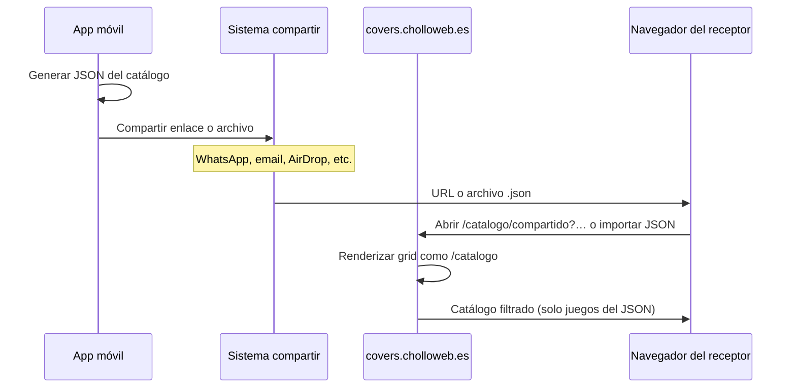

# Compartir catálogo vía web (sin datos personales)

> **Estado:** idea / pendiente de implementar  
> **Prioridad sugerida:** media  
> **Fecha de registro:** 2026-05-31

## Objetivo

Permitir que un usuario de la app móvil **comparta su catálogo de juegos** de forma sencilla (hoja de compartir nativa del móvil) para que **otra persona pueda consultarlo en un navegador**, con la misma experiencia visual que el catálogo público en [https://covers.cholloweb.es/catalogo](https://covers.cholloweb.es/catalogo), pero **limitado a los juegos incluidos en el JSON compartido**.

Sin registro, sin cuentas y **sin tratar datos personales**: solo un snapshot anónimo del catálogo (metadatos de juegos).

---

## Principios de privacidad

- **No** identificar al propietario del catálogo (sin nombre, email, ID de usuario ni device ID en el payload).
- **No** almacenar datos personales en el servidor más allá de lo estrictamente necesario para mostrar el catálogo compartido (ver opciones de alojamiento abajo).
- El JSON exportado debe contener **solo datos de juegos** (título, plataforma, portada, etc.), no notas privadas ni campos internos de la app si no aportan valor al visor web.
- Alinear con la política ya publicada: [https://covers.cholloweb.es/privacidad](https://covers.cholloweb.es/privacidad).

---

## Flujo de usuario (visión)



### Propietario (app)

1. Desde catálogo o ajustes: acción **«Compartir catálogo»** (distinta de «Exportar JSON» para backup, aunque pueden compartir el mismo formato base).
2. La app genera un JSON con los juegos visibles del catálogo local.
3. Se abre el diálogo nativo de compartir con una de estas opciones (a decidir en implementación):
   - **Opción A — Enlace:** subir el JSON al VPS y compartir una URL corta, p. ej. `https://covers.cholloweb.es/catalogo/compartido/{token}`.
   - **Opción B — Archivo:** compartir el `.json` directamente; el receptor lo abre en la web mediante «Importar catálogo compartido» (drag & drop o selector de archivo).
   - **Opción C — Híbrida:** enlace por defecto; archivo como alternativa offline.

### Receptor (navegador)

1. Abre el enlace o importa el JSON en la web.
2. Ve el catálogo con el **mismo layout/UI** que `/catalogo` (grid de portadas, filtros básicos si aplican).
3. Solo aparecen los juegos del JSON; no el catálogo completo del VPS.

---

## Punto de partida en la app (ya existente)

La app ya exporta JSON desde ajustes:

- Función: `exportCatalogAsJson()` en `database/dbConfig.ts`
- Formato actual (`formatVersion: 4`):

```json
{
  "exportedAt": "2026-05-31T12:00:00.000Z",
  "app": "CoverLens",
  "formatVersion": 4,
  "items": [ /* GameRecord[] */ ]
}
```

- UI actual: botón en `app/(tabs)/ajustes.tsx` («Exportar catálogo»).

**Trabajo app:** reutilizar o derivar este export; añadir acción dedicada «Compartir catálogo» con copy orientado a compartir (no backup). Valorar un **formato «share»** (`formatVersion` o campo `purpose: "share"`) que excluya campos innecesarios (`lastError`, IDs locales, URIs `file://` de miniaturas locales, etc.) y normalice URLs de portada a HTTP(S) cuando existan.

---

## Punto de partida en la web (VPS)

Catálogo de referencia: [https://covers.cholloweb.es/catalogo](https://covers.cholloweb.es/catalogo)

Infraestructura documentada en `docs/API_TERMS_COMPLIANCE.md` y `docs/Permisos_servicios_terceros.txt`:

- SPA/catálogo en `/catalogo`
- API de juegos: `/games/{platform}/{slug}.json`, `/games/platforms.json`
- Portadas: `/covers/{platform}/{slug}.jpg|webp`

**Trabajo web:** nuevo apartado, p. ej.:

| Ruta propuesta | Comportamiento |
|----------------|----------------|
| `/catalogo/compartido/{id}` | Carga snapshot alojado en servidor por token/opaco |
| `/catalogo/compartido` | Pantalla de importación de JSON local (Opción B) |

Reutilizar componentes de grid, tarjetas y filtros del catálogo actual; la fuente de datos pasa de la API global del VPS a **lista derivada del JSON importado**.

### Resolución de portadas en el visor

Prioridad sugerida al renderizar cada ítem del JSON:

1. `coverUrl` / `headerImageUrl` del JSON si es URL pública.
2. Match en catálogo VPS por barcode + plataforma o título + plataforma (slug).
3. Placeholder genérico si no hay imagen.

---

## Formato JSON propuesto (borrador)

Extender o perfilar el export existente:

```json
{
  "exportedAt": "2026-05-31T12:00:00.000Z",
  "app": "CoverLens",
  "formatVersion": 4,
  "purpose": "share",
  "items": [
    {
      "title": "Super Mario Odyssey",
      "platform": "Nintendo Switch",
      "barcode": "0045496424126",
      "releaseYear": 2017,
      "genre": "Plataformas",
      "developer": "Nintendo",
      "publisher": "Nintendo",
      "coverUrl": "https://covers.cholloweb.es/covers/switch/super-mario-odyssey.jpg",
      "favorite": false,
      "discOnly": false
    }
  ]
}
```

Campos opcionales a excluir en `purpose: "share"`: `id`, `metadataStatus`, `lastError`, `coverLocalThumbUri`, `valueCents` (si no se quiere mostrar valor de mercado al compartir).

---

## Opciones de alojamiento del enlace (Opción A)

| Enfoque | Pros | Contras |
|---------|------|---------|
| **Subida al VPS + token opaco** | Enlace corto, fácil de abrir en móvil | Requiere endpoint POST, almacenamiento y política de caducidad |
| **Solo archivo JSON** | Cero backend, máxima privacidad | Peor UX en móvil; el receptor debe importar manualmente |
| **JSON en query/hash (Base64)** | Sin servidor | URLs enormes; límites de longitud en algunos apps de mensajería |

Recomendación inicial para MVP: **Opción B (archivo)** reutilizando `Sharing.shareAsync` + página web de importación; después **Opción A** con tokens aleatorios, caducidad (p. ej. 30 días) y sin metadatos del usuario.

---

## Tareas de implementación (checklist)

### App móvil

- [ ] Acción «Compartir catálogo» (catálogo o ajustes)
- [ ] Export «share» sin datos personales ni campos internos
- [ ] Normalizar portadas a URLs remotas cuando sea posible
- [ ] (Fase 2) Subida al VPS y compartir URL en lugar de solo archivo
- [ ] Texto de ayuda: «Comparte tu colección; no se envía información personal»

### Web (covers.cholloweb.es)

- [ ] Ruta `/catalogo/compartido` con importación de JSON
- [ ] (Fase 2) Ruta `/catalogo/compartido/{token}` + API de publicación
- [ ] Renderizado con mismos estilos que `/catalogo`
- [ ] Filtros/ordenación sobre el subconjunto importado
- [ ] Mensaje claro si el JSON es inválido o está vacío

### Legal / producto

- [ ] Confirmar que no hace falta actualizar privacidad si no hay datos personales ni persistencia identificable
- [ ] Si hay alojamiento en VPS: mencionar retención temporal y caducidad en privacidad

---

## Criterios de éxito

- Un usuario comparte su catálogo en &lt; 3 toques desde la app.
- Un receptor abre el enlace o archivo y ve un catálogo legible en el navegador sin instalar la app.
- No se recogen ni muestran datos que identifiquen al propietario.
- La experiencia visual es coherente con [covers.cholloweb.es/catalogo](https://covers.cholloweb.es/catalogo).

---

## Referencias en el repo

| Recurso | Ubicación |
|---------|-----------|
| Export JSON actual | `database/dbConfig.ts` → `exportCatalogAsJson()` |
| Import JSON (simetría) | `services/import/catalogImport.ts` |
| Botón export en UI | `app/(tabs)/ajustes.tsx` |
| Proveedor VPS / URLs | `services/providers/chollwebVpsProvider.ts` |
| Política de privacidad | `docs/PRIVACY_POLICY_ES.md` |

---

## Notas para la sesión de mañana

1. Decidir MVP: **solo importación web de JSON** vs **enlace hospedado** desde el primer día.
2. Revisar qué campos de `GameRecord` son imprescindibles para el visor web.
3. Comprobar si el frontend de `/catalogo` vive en este repo o solo en el VPS (afecta dónde implementar la web).
