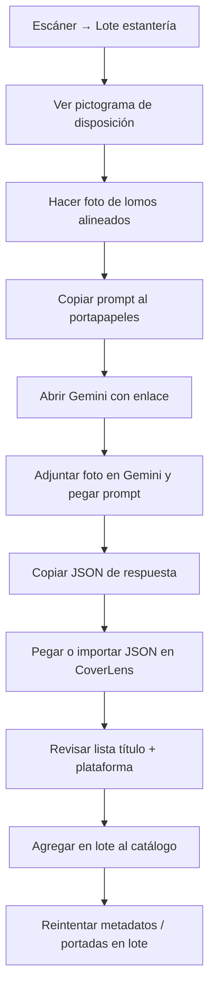

# Procesamiento por lote: estantería + IA externa (Gemini)

> **Estado:** idea / pendiente de implementar  
> **Prioridad sugerida:** media–alta (sustituye la vía OCR nativa/terceros en el escáner)  
> **Fecha de registro:** 2026-05-31

## Objetivo

Sustituir en la pestaña **Escáner** el enfoque actual de **OCR nativo o vía terceros** (ML Kit, OCR.space, etc.) por un flujo de **alta en lote** basado en:

1. **Una fotografía** de los **lomos** de los juegos en la estantería (varios títulos en una sola imagen).
2. **Guía visual** (pictograma) de cómo deben estar dispuestos los juegos para que la IA lea bien los cantos.
3. **Prompt listo para copiar** al portapapeles y **enlace para abrir Gemini** con la foto adjunta fuera de la app.
4. **JSON devuelto por la IA** que encaje con el importador de CoverLens (`title` + `platform` por juego) para **importar en lote** y, a continuación, resolver metadatos/portadas con la misma cadena que la búsqueda manual.

La app **no procesa la imagen con OCR en el dispositivo** en esta vía: delega la lectura de lomos a un modelo multimodal elegido por el usuario (Gemini como referencia documentada).

---

## Por qué se aparca el OCR en la app

| Enfoque actual (pausado) | Nuevo enfoque |
|--------------------------|---------------|
| ML Kit en build nativo (`escaner.tsx`, `ocrParser.ts`) | Sin dependencia de build nativo para leer lomos |
| OCR.space u otros APIs en `ROADMAP.md` | Sin API key de OCR ni cuota en servidor propio |
| Un juego por foto (canto individual) | **Varios juegos** en una foto de estantería |
| Requiere hardware/Xcode o cuenta EAS | Funciona en **Expo Go** si solo hace falta cámara + compartir + pegar JSON |

El código OCR existente puede **mantenerse oculto o deprecado** hasta decidir retirarlo; esta mejora redefine el modo «OCR» del escáner como **«Lote por foto + IA»**.

Referencias del estado actual: `ROADMAP.md` (sección OCR), `app/(tabs)/escaner.tsx` (modo `ocr`), `services/utils/ocrParser.ts`.

---

## Flujo de usuario (visión)



### Pantalla del escáner (modo reemplazado)

Contenido previsto del apartado (sustituye UI de «Portada OCR»):

| Elemento | Descripción |
|----------|-------------|
| **Pictograma** | Ilustración estática (asset en `assets/`) que muestra: lomos visibles, títulos hacia la cámara, poca inclinación, luz uniforme, una plataforma por estantería si es posible |
| **Botón «Hacer foto»** | Abre cámara o galería; la foto es para que el usuario la lleve a Gemini (no se envía a servidores CoverLens) |
| **Botón «Copiar prompt»** | `expo-clipboard` — copia el texto de `constants/shelfBatchGeminiPrompt.ts` (nombre provisional) |
| **Botón «Abrir Gemini»** | `Linking.openURL` → URL configurable (p. ej. `https://gemini.google.com/app`) |
| **Botón «Pegar JSON» / «Importar»** | Pega desde portapapeles o abre selector de `.json`; valida con `parseCatalogImport` |
| **Vista previa** | Lista de `{ title, platform }` detectados antes de confirmar |
| **Confirmar lote** | Llama a `importCatalogRows` con progreso; opcionalmente encadena resolución de metadatos |

Texto de ayuda breve: *«La imagen se analiza en Gemini, no en CoverLens. No enviamos tu foto a nuestros servidores.»*

---

## Pictograma de disposición (requisitos de diseño)

El asset debe comunicar sin texto largo:

- Juegos **en fila**, lomos hacia el objetivo (no tapas).
- **Misma altura** de lomo en la fila (apoyados alineados).
- **Sin reflejos fuertes** ni cortes: todo el texto del lomo dentro del encuadre.
- Preferible **una consola/plataforma** por foto (reduce ambigüedad en el prompt).
- Distancia media: que se lean títulos pero que quepan **máximo ~15–25 lomos** legibles (límite orientativo para la IA).

---

## Prompt para Gemini (borrador — copiar al portapapeles)

Texto a mantener en código como constante versionada. El usuario lo pega en Gemini **junto con la foto**.

```
Eres un asistente que extrae juegos de videojuegos físicos a partir de una FOTO DE LOMOS en una estantería.

Instrucciones:
1. Mira solo los lomos visibles (cantos estrechos con título y a menudo plataforma).
2. Por cada juego detectado, devuelve título comercial en español o inglés (el que se lea mejor) y plataforma/consola.
3. Normaliza plataforma a uno de estos nombres cuando aplique: Nintendo Switch, PlayStation 5, PlayStation 4, PlayStation 3, Xbox Series X|S, Xbox One, Xbox 360, Wii U, Wii, Nintendo 3DS, Nintendo DS, PC, GameCube, Nintendo 64.
4. Si no puedes leer un lomo con confianza, omítelo (no inventes).
5. Si un mismo título aparece dos veces, inclúyelo solo una vez.
6. Responde ÚNICAMENTE con un bloque JSON válido, sin markdown ni explicación.

Formato exacto:
{
  "app": "CoverLens",
  "formatVersion": 1,
  "purpose": "shelf_batch",
  "items": [
    { "title": "Nombre del juego", "platform": "Nintendo Switch" }
  ]
}

Reglas del JSON:
- "items" es un array; cada elemento debe tener "title" y "platform" (strings no vacíos).
- No incluyas comentarios, campos extra ni texto fuera del JSON.
```

**Notas de producto**

- Revisar el prompt cuando se amplíe la lista de plataformas en `platformTokens.ts`.
- Versión en inglés opcional si el usuario tiene Gemini en inglés (fase 2).
- Ajustar el límite de juegos por foto según pruebas reales.

---

## Formato JSON esperado (compatible con CoverLens)

Mínimo para importación (ya soportado por `parseCatalogImport` / `coverLensItemToRow`):

```json
{
  "app": "CoverLens",
  "formatVersion": 1,
  "purpose": "shelf_batch",
  "items": [
    { "title": "The Legend of Zelda: Tears of the Kingdom", "platform": "Nintendo Switch" },
    { "title": "Super Mario Odyssey", "platform": "Nintendo Switch" }
  ]
}
```

También válido (array suelto):

```json
[
  { "title": "Super Mario Odyssey", "platform": "Nintendo Switch" }
]
```

Campos opcionales que la IA **no debe** rellenar en el MVP: `barcode`, `coverUrl`, `id` local. Tras el alta, CoverLens completa metadatos con `resolveMetadata` (igual que búsqueda manual por título + plataforma).

**Detección en importador (fase implementación):** reconocer `purpose: "shelf_batch"` para mensajes UI específicos («Importar lote desde estantería») aunque el parser actual ya acepte `items` con `app: "CoverLens"`.

---

## Integración técnica en la app

### Reutilizar

| Pieza | Ubicación |
|-------|-----------|
| Import en lote | `importCatalogRows()` en `database/dbConfig.ts` |
| Parseo JSON | `parseCatalogImport()` en `services/import/catalogImport.ts` |
| Normalización plataforma | `normalizePlatformFieldForStorage()` en `services/utils/platformTokens.ts` |
| Metadatos tras import | «Reintentar metadatos» en `app/(tabs)/ajustes.tsx` (existente) |
| Portadas tras import | «Descargar portadas en lote» (existente) |

### Nuevo (previsto)

- [ ] Constante `SHELF_BATCH_GEMINI_PROMPT` + `SHELF_BATCH_GEMINI_URL`
- [ ] Asset pictograma `assets/shelf-spine-guide.png` (o SVG vía componente)
- [ ] Refactor modo `ocr` → `shelf_batch` (o renombrar pestaña a «Lote») en `escaner.tsx`
- [ ] Modal: pegar JSON → preview → confirmar → `importCatalogRows`
- [ ] (Opcional) Tras import, ofrecer «Resolver metadatos ahora» con la misma lógica que `onRetryMetadata` en ajustes, sin obligar al usuario a ir a Ajustes
- [ ] Tests: fixture JSON `purpose: shelf_batch` → `parseCatalogImport` → N filas válidas

### Privacidad

- La **foto no sale de la app** hacia CoverLens VPS en este flujo (solo el usuario la sube a Gemini bajo sus términos de Google).
- El **JSON** solo contiene títulos y plataformas de juegos; puede pegarse/importarse localmente.
- Mencionar en la pantalla que es un flujo **opcional** y **externo** a CoverLens.

---

## Enlace «Abrir Gemini»

| Plataforma | Comportamiento |
|------------|----------------|
| iOS / Android | `Linking.openURL('https://gemini.google.com/app')` (o app Gemini si `canOpenURL` con esquema oficial cuando exista) |
| Fallback | Copiar prompt + indicar al usuario que abra Gemini manualmente |

No depender de deep links con la imagen ya adjunta (limitación de Gemini); el flujo es: **foto en galería → usuario adjunta en Gemini**.

---

## Criterios de éxito

- Un usuario fotografía una estantería, obtiene JSON en Gemini y añade **≥ 80 %** de los lomos legibles al catálogo en un solo flujo.
- No se requiere build nativo ni clave OCR para esta función.
- El JSON pegado importa sin pasar por Ajustes (aunque Ajustes puede seguir aceptando el mismo formato).
- Tras el lote, «Reintentar metadatos» completa fichas igual que tras import Playnite/CSV.

---

## Relación con otras mejoras

- **Import catálogo** (Ajustes): mismo motor; el modo escáner es atajo UX + pictograma + prompt Gemini.
- **OCR nativo** (`ROADMAP.md`): queda **aparcado**; no bloquea esta mejora.
- **Compartir catálogo** (`COMPARTIR_CATALOGO_WEB.md`): flujo opuesto (exportar vs. importar lote desde foto).

---

## Checklist de implementación

### Diseño / contenido

- [ ] Pictograma de disposición de lomos
- [ ] Copy de ayuda en escáner (ES)
- [ ] Revisión legal breve (uso de Gemini = tercero Google, fuera de VPS CoverLens)

### App

- [ ] UI modo lote en `escaner.tsx`
- [ ] Copiar prompt + abrir Gemini
- [ ] Pegar/importar JSON + preview + confirmación
- [ ] `importCatalogRows` con barra de progreso
- [ ] CTA opcional «Resolver metadatos ahora»

### Calidad

- [ ] Pruebas con fotos reales (Switch, PS4, mezcla)
- [ ] Afinar prompt si Gemini devuelve markdown o campos extra
- [ ] Documentar en guía testers si hace falta

---

## Referencias en el repo

| Recurso | Ubicación |
|---------|-----------|
| Modo OCR actual | `app/(tabs)/escaner.tsx` |
| Parser OCR (legacy) | `services/utils/ocrParser.ts` |
| Import JSON | `services/import/catalogImport.ts` |
| Alta en lote SQLite | `database/dbConfig.ts` → `importCatalogRows` |
| Roadmap OCR pausado | `ROADMAP.md` |
